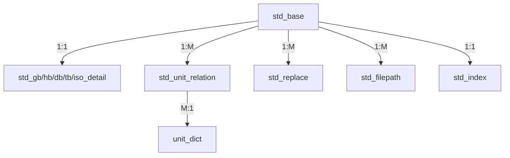

# 标准管理系统 V3：全库插入数据逻辑手册 (Complete Logic Manual)

本手册旨在对标准管理系统的核心数据流转、清洗算法及每个表的入库细节进行丝毫不差的定义。本手册是系统维护、数据迁移及逻辑对齐的最高准则。

---

## 1. 整体架构设计
系统采用 **“一主、五从、多维、一索”** 的解耦架构，确保各标准类型的业务字段互不干扰：
- **核心表 (`std_base`)**: 存储所有标准的共性字段，生成唯一的 `base_id`。
- **详情表 (`std_xx_detail`)**: 存储国、行、地、团、国际标准的特有业务字段。
- **画像表 (`unit_dict`, `area_dict`)**: 实现单位实体的标准化与地理画像。
- **关系表 (`std_unit_relation`, `std_replace`)**: 建立标准与单位、标准与标准之间的复杂联系。
- **文件表 (`std_filepath`)**: 物理文件路径与数据库记录的映射。

---

## 2. 标准入库 6 步走核心流程

### 第一步：数据预清洗 (Preprocessing)
- **标准号标准化**：
    - 去除所有空格，统一转大写。
    - **全角转半角**：将 `∕` 替换为 `/`，将 `—` 和 `－` 替换为 `-`，将 `（）` 替换为 `()`。
    - **变体修正**：将 `G-B`, `GBT`, `GB_T`, `G-BT` 统一规范为 `GB/T`。
- **日期标准化**：强制使用 `YYYY-MM-DD` 格式，无法解析的脏数据填充为 `NULL`。
- **状态映射**：将“废止”映射为 `0`，“现行”映射为 `1`，“即将实施”映射为 `2`。

### 第二步：主表落库 (`std_base`)
- **动作**：`INSERT IGNORE`。
- **逻辑**：以 `std_id` 作为唯一索引。如果库中已存在该标准号，则跳过本次插入，不覆盖原有数据。
- **产出**：通过 `cursor.lastrowid` 捕获该条记录的 `base_id`。

### 第三步：详情表精准分流 (`std_detail`)
根据 `std_type_no` 将数据分流至对应详情表。
- **`std_gb_detail` (国标, 00)**：关联 `base_id`，存储 `ccs`, `ics`, `drafter` (起草人文本)。
- **`std_hb_detail` (行标, 01)**：存储 `record_no` (备案号), `industry_type` (行业领域)。
- **`std_db_detail` (地标, 02)**：存储 `suggest_dept` (提出单位), `approve_dept` (批准单位)。
- **`std_tb_detail` (团标, 03)**：存储 `gbc` (国民经济行业代码)。
- **`std_iso_detail` (国际, 04)**：存储 `std_version` (版本), `std_rele_issue` (发布组织)。

### 第四步：起草单位实体化 (`unit_dict` & `relation`)
1. **提取**：从原始文本中按常用分隔符（逗号、分号、顿号）拆分单位。
2. **清洗**：调用 `clean_unit_name()` 移除括号内容及行政区划前缀（如“福州市” -> “福州”）。
3. **入库字典**：`INSERT IGNORE INTO unit_dict`。
4. **建立关系**：在 `std_unit_relation` 记录 `base_id` 与 `unit_id`。
   - `role_type`: 1 为牵头人，2 为参与人。
   - `rank_order`: 按照单位出现的物理先后顺序记录。

### 第五步：演进关系链构建 (`std_replace`)
- **逻辑**：解析“被替代标准”字段。
- **映射**：使用 `std_id -> id` 的全库内存索引查找被替代标准的 `replace_id`。
- **落库**：写入 `std_replace`。若前身标准未在库中，则 `replace_id` 填 `NULL`，但 `replace_std_name` 必须保留原始字符串。

### 第六步：物理附件挂载 (`std_filepath`)
- **逻辑**：极速扫描 NAS 目录。
- **二级匹配算法**：
    1. **精确匹配**：文件名提取的标准号与 `std_base.std_id` 完全一致。
    2. **前缀回退**：若精确匹配失败，剥离年份后通过 `fallback_map` 匹配标准前缀。
- **落库**：关联 `base_id`，存储相对路径、原始文件名及字节数。

---

## 3. 核心清洗工具函数 (Algorithm)

### `clean_id(text)` - 标准号规范化
```python
def clean_id(text):
    text = text.upper().replace(' ', '')
    text = text.translate(str.maketrans('∕—＿（）－', '/---(-'))
    text = text.replace('G-B', 'GB').replace('GBT', 'GB/T')
    return text
```

### `super_clean(text)` - 文件名极速匹配
```python
def super_clean(text):
    """抹除一切格式噪声，仅对比字母和数字"""
    text = text.upper()
    return re.sub(r'[^A-Z0-9]', '', text)
```

### `clean_unit_name(name)` - 单位名称净化
1. 移除 `( )` 和 `（ ）` 及其内部内容。
2. 去除末尾的 `(盖章)` 等冗余词汇。
3. 丢弃长度 <= 3 的异常数据。

---

## 4. 性能与安全准则
- **极速写入**：强制开启批量插入模式，`batch_size = 2000`。
- **内存优先**：入库前将 `std_id -> base_id` 加载到 Python Dict 中，严禁在循环内进行 `SELECT` 查询。
- **顺序一致性**：必须严格遵循 **先主表、后从表、再关系** 的顺序。禁止产生孤立的详情记录。
- **事务安全**：每个 Batch 完成后统一 `commit()`，任何一步报错必须全量 `rollback()`。

---

## 5. 表关系图示 (ER Graph)


> [!IMPORTANT]
> **逻辑红线**：
> 1. 标准号 `std_id` 是系统的唯一灵魂，任何录入前必须经过 `clean_id` 校验。
> 2. `base_id` 是全局关联的纽带，一旦 `std_base` 插入失败，后续所有关联动作必须立即停止。
